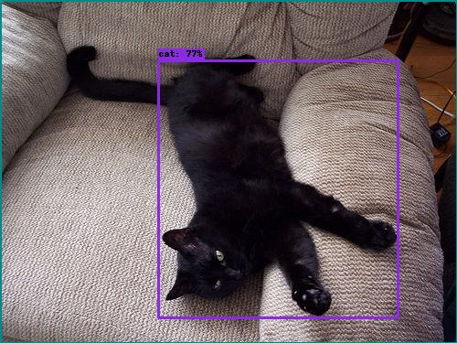
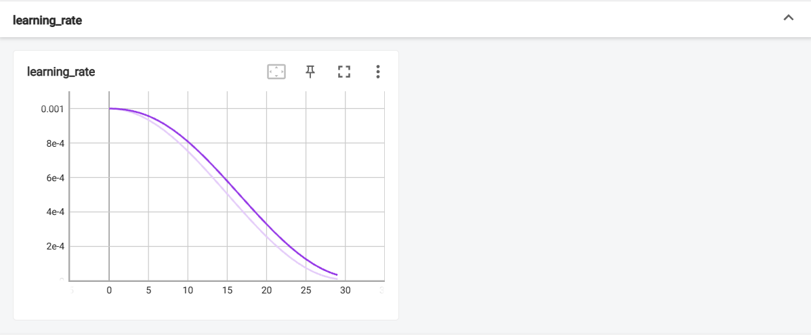
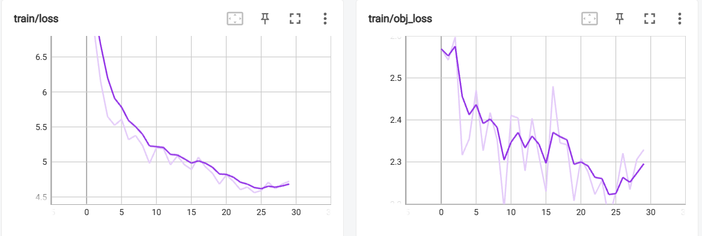
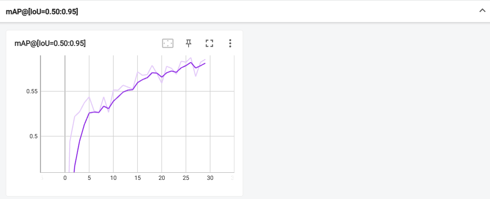
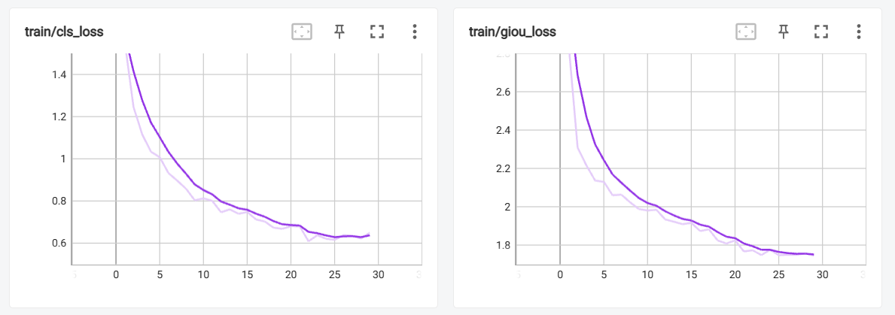

# YOLOv3SPP

## Projects

ultralytic/yolov3:

## Requirements

requirements.txt

## 数据集Pascal VOC2012 

Pascal VOC2012：http://host.robots.ox.ac.uk/pascal/VOC/voc2012/VOCtrainval_11-May-2012.tar

## Object class

aeroplane
bicycle
bird
boat
bottle
bus
car
cat
chair
cow
diningtable
dog
horse
motorbike
person
pottedplant
sheep
sofa
train
tvmonitor

## Pre-Processing

- Mosaic：随机拼接，随机旋转，缩放
- augment_hsv

## train

进行30个epochs,batch_size=4。

使用multi-scale，每64张图片随机修改一次输入图片大小。

使用随机梯度下降。

## 简单的预测

predict_test.py一个简单的预测脚本。

`results20230406-214117.txt` :记录每个epoch的12个指标和总损失、lr

Average Precision (AP) @[IoU =0.50:0.95] | area = all | maxDets=100]  
Average Precision (AP) @[IoU =0.50] | area = all | maxDets=100]  
Average Precision (AP) @[IoU =0.75] | area = all | maxDets=100]  
Average Precision (AP) @[IoU =0.50:0.95] | area = smalll | maxDets=100]  
Average Precision (AP) @[IoU =0.50:0.95] | area = medium | maxDets=100]  
Average Precision (AP) @[IoU =0.50:0.95] | area = large | maxDets=100]  
Average Recall (AR) @[IoU =0.50:0.95] | area = all | maxDets=1]  
Average Recall (AR) @[IoU =0.50:0.95] | area = all | maxDets=10]  
Average Recall (AR) @[IoU =0.50:0.95] | area = all | maxDets=100]  
Average Recall (AR) @[IoU =0.50:0.95] | area = small | maxDets=100]  
Average Recall (AR) @[IoU =0.50:0.95] | area = medium | maxDets=100]  
Average Recall (AR) @[IoU =0.50:0.95] | area =large | maxDets=100]  

